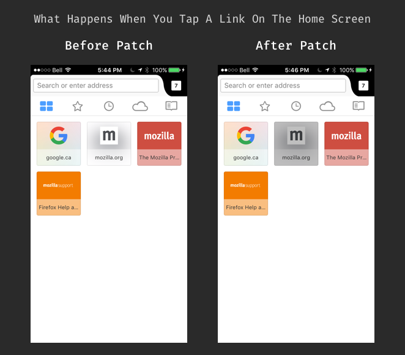

# CSC302 A3 Report

#### Firefox for iOS — Bug 1145380 - No touch feedback on home screen links
**https://bugzilla.mozilla.org/show_bug.cgi?id=1145380**

## Bug Description

There were inconsistencies in the touch feedback in the app. Specifically, when users tap a link in the Bookmarks, History, or Reading List, the links have a grey highlight. However, if users tap a link on Firefox’s home screen, the links do not have the same highlight effect. There should not be any major risks in adding this in, as it is a small UI fix. The UI code is isolate from the business logic of the app.

## Propose Solution

I need to detect when a cell on Firefox’s home screen is tapped, and I need to add a gray highlight effect to the cell when this occurs.

## Testing

I will test it on my iPhone. I will make sure that the highlight effect is similar to the effect in the other parts of the app.

## Screenshots

## Patch

See [the patch file](https://github.com/shivbaijal/firefox-ios/blob/CSC302_A3_Bug_1145380/1145380.patch)
